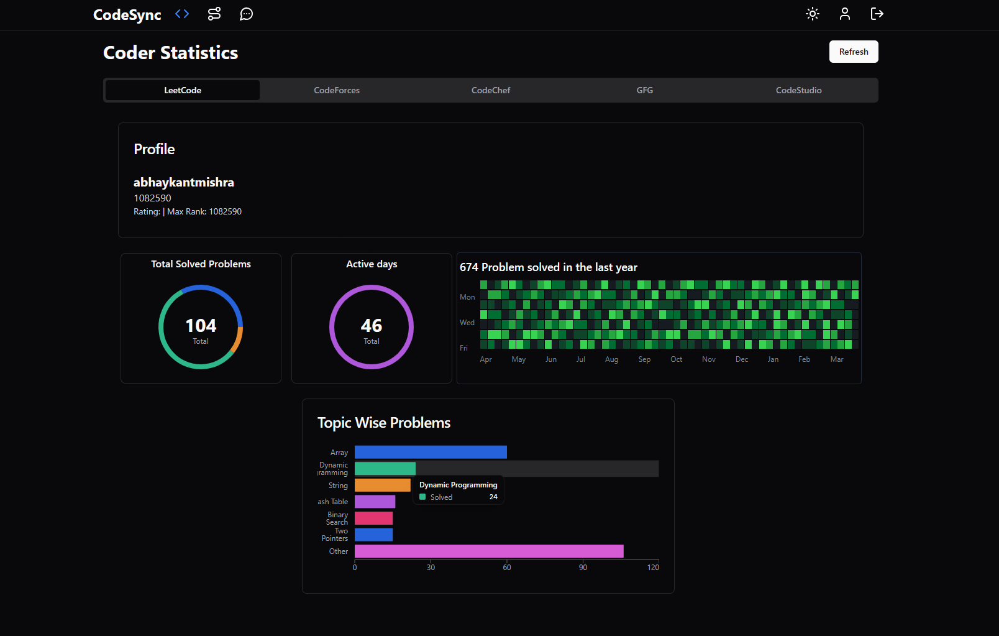
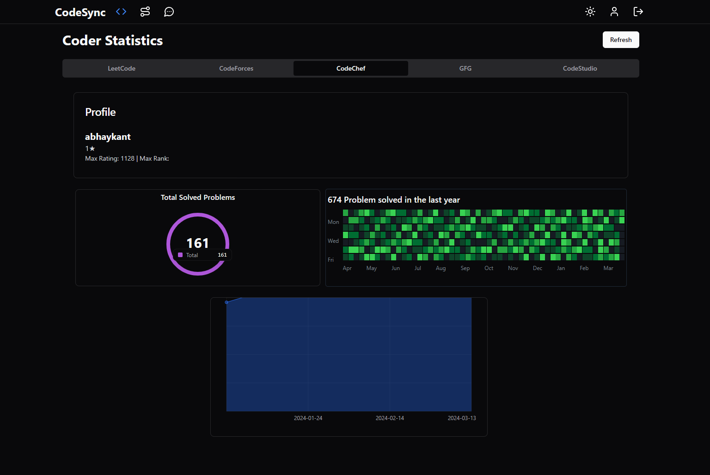
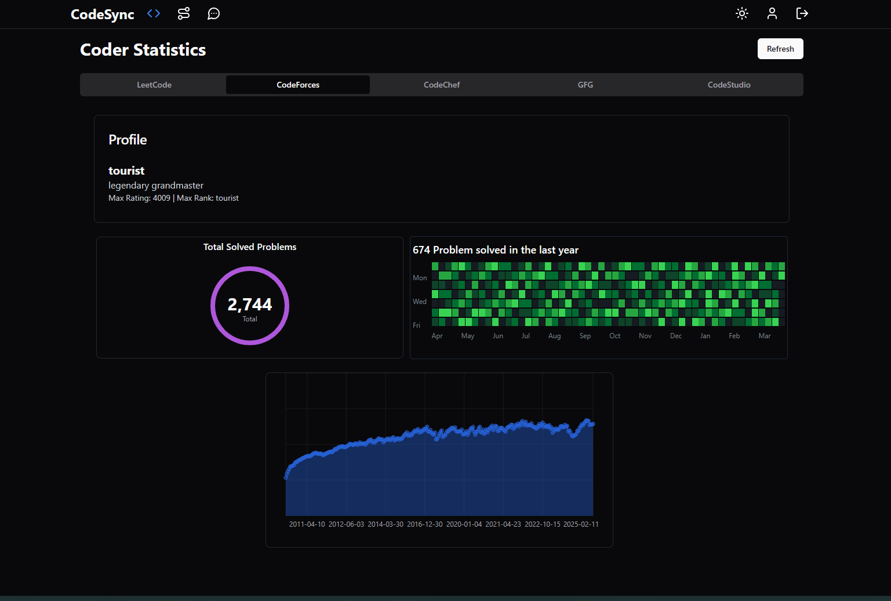
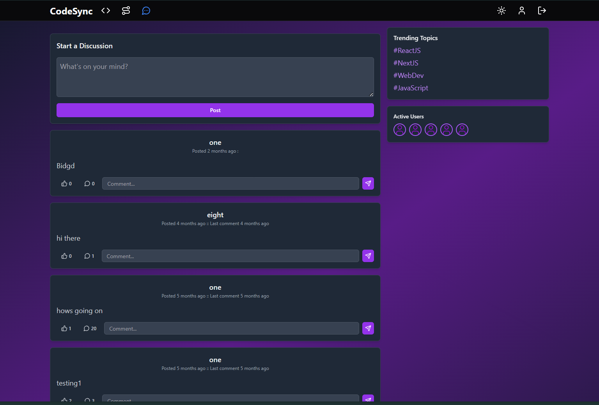
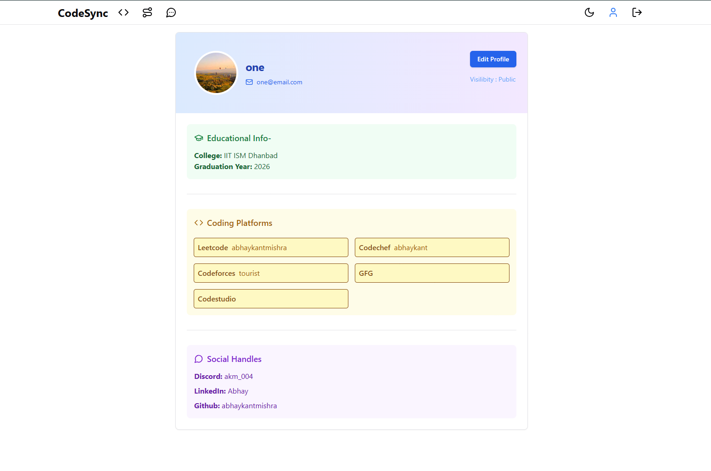
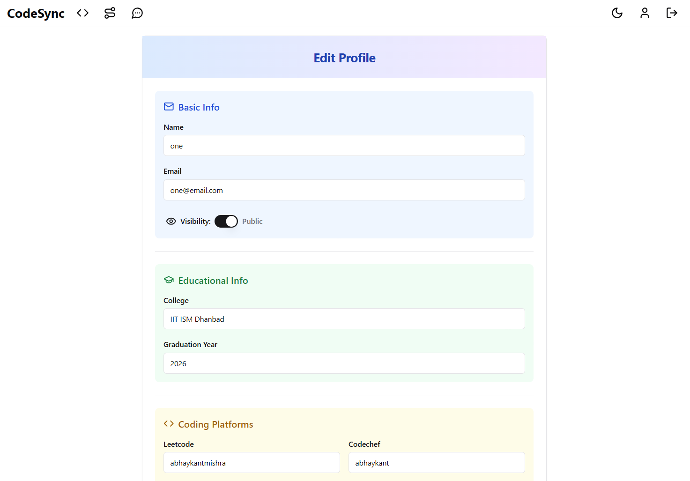

# 🚀 Coding Platform Management System


💡 Boost your productivity by tracking and improving your coding performance with this powerful management system!

A powerful management system to monitor and display statistics of users across multiple coding platforms, revealing insights and customizable learning roadmaps.

🔗 **Live Application:** [Check it out here](https://codesync-next.vercel.app/)

### 🔑 **Testing Credentials for login:**
   *email: one@email.com* |
   *password: 12345678* 

## 🌟 Features

- 🔑 **User Authentication** – Create and log in to your profile.
- 📊 **Unified Dashboard** – Track all your coding activities in one place.
- 🔗 **Multi-Platform Support** – Integrate with LeetCode, Codeforces, CodeChef, GFG, and CodeStudio.
- 💬 **Discussion Page** – Engage in meaningful discussions with other coders.
- 🛠 **Profile Customization** – Edit your profile and add your coding handles.
- 🌙 **Dark & Light Mode** – Toggle between themes for a better experience.
- 🛤 **Roadmap Generation** – Get a personalized roadmap to improve your coding skills.

## 🔥 Use Cases

- 📌 Monitor coding progress across multiple platforms effortlessly.
- 🗂 Keep all your problem-solving stats in a single dashboard.
- 🤝 Collaborate with peers on the discussion page.
- 🎯 Generate a tailored roadmap for structured learning.

## 🖼 Project Tour

### 📌 Dashboard – Monitor All Activities


| 📊 LeetCode Statistics | 📊 CodeChef Statistics | 📊 Codeforces Statistics |
|---------|---------|---------|
|  |  |  |

<!-- 
#### 📊 LeetCode Statistics




#### 📊 CodeChef Statistics



#### 📊 Codeforces Statistics


 -->

### 🛤 Roadmap Page

<!--  -->


### 🗣 Discussion Page
<!--  -->


### 🔗 Profile Page

<!--  -->


### 📜 Edit Profile Page

<!--  -->


### 🎭 Dark & Light Mode
| Dark Mode | Light Mode |
|-----------|-----------|
|  |  |

&#x20;

## 🚀 Getting Started

### 🛠 Installation

1. **Clone the Repository**
   ```bash
   git clone https://github.com/abhaykantmishra/CodeSync.git
   ```
2. **Navigate to the Project Directory**
   ```bash
   cd CodeSync
   ```
3. **Install Dependencies**
   ```bash
   npm install
   ```
4. **Run the Application**
   ```bash
   npm run dev
   ```

<!-- ## 📜 License

This project is licensed under the MIT License. -->

---

💡 **Contributions are welcome!** Feel free to fork this repository and submit a pull request. 🚀
